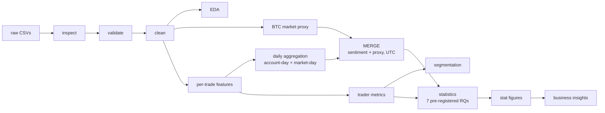

# Trader Performance vs Market Sentiment

Does Bitcoin market sentiment (the **Fear & Greed Index**) relate to how traders **behave** and
**perform** on **Hyperliquid** — and is any pattern actionable?

> **Bottom line:** Sentiment is a **risk-monitoring** signal, not an alpha signal. The apparent
> "traders earn more on Greed days" pattern **disappears once the Bitcoin price move is controlled**
> (it is market beta, not a sentiment edge). The one clear behavioural shift is that traders take
> **larger positions on Greed days** — a large but under-powered, risk-relevant finding.

## Major findings (30-second read)

| # | Finding | Evidence | Confidence |
|---|---------|----------|------------|
| 1 | The Greed-day PnL "edge" is a **market-direction artifact** — it vanishes after controlling for the BTC move | RQ1→RQ7 (+179 → +65 USD/day, CI crosses 0) | **Confirmed** |
| 2 | Traders take **larger positions on Greed days** (risk-on sizing) | RQ4 (rank-biserial 0.57, +107 USD median) | **Likely** (under-powered, n=20) |
| 3 | Sentiment is associated with **long/short direction**, but only weakly | RQ6 (Cramér's V 0.19) | **Confirmed but small** |
| 4 | **No** reliable difference in per-trader PnL, win rate, or trade frequency | RQ2 / RQ3 / RQ5 | No evidence |

Full report: [`outputs/business_insights.md`](outputs/business_insights.md) ·
evidence: [`outputs/statistical_analysis.md`](outputs/statistical_analysis.md) ·
notebook: [`notebooks/01_analysis.ipynb`](notebooks/01_analysis.ipynb).

## Motivation
Fear/Greed is widely treated as a trading signal. This project tests, rigorously and honestly,
whether it actually predicts trader behaviour or performance in a real trader dataset — and, crucially,
whether any effect survives the obvious confounder: sentiment is *derived from price*, so a naive
"sentiment → PnL" result may just be market direction. The analysis is built as a reproducible,
auditable pipeline with a frozen decision log.

## Pipeline / architecture



Design principles: **raw data immutable**; cleaning is **non-destructive** (flags, never silent drops);
every rate/ratio is **weighted, never averaged**; methodology (timezone, window) was **fixed before**
looking at any test result; every material decision is recorded in
[`ASSUMPTIONS_LOG.md`](ASSUMPTIONS_LOG.md).

## Repository structure
```
config.yaml                 # verified schema + integrity flags (single source of truth)
ASSUMPTIONS_LOG.md          # frozen facts (F/E-ids) + decision log (D-ids) — governance
requirements.txt            # pinned dependencies
data/
  download.py               # reproducible Google-Drive fetch → data/raw/ (git-ignored)
src/                        # ALL analytical logic (imported by scripts & notebook)
  config, io_utils, validate, clean_*, market_context, features,
  aggregate, merge, metrics, segments, stats, viz, provenance
scripts/                    # thin runners: one per module, each writes an outputs/ report
notebooks/01_analysis.ipynb # orchestration + narrative (no logic — imports src/)
tests/                      # 62 unit tests (pytest)
outputs/                    # generated reports, figures (PNG+SVG), metric/merge/EDA docs
```

## Installation
```bash
python -m venv .venv && source .venv/bin/activate     # Python 3.12
pip install -r requirements.txt
```

## Reproducibility & execution order
**Two ways to reproduce — both auto-fetch the raw data:**

**A. One notebook (recommended, ~1 min):** open `notebooks/01_analysis.ipynb` → **Run All**.
The first code cell runs the entire pipeline in order (raw download is skipped if already present),
the rest narrate the results with embedded figures.

**B. Command line:**
```bash
python data/download.py            # fetch raw data
python scripts/inspect_data.py     # M1  → outputs/data_quality_report.md
python scripts/validate_data.py    # M2  → outputs/validation_report.md
python scripts/clean_data.py       # M3  → outputs/cleaning_report.md   (+ data/interim/)
python scripts/run_eda.py          # M4  → outputs/eda_summary.md       (+ figures)
python scripts/build_market_context.py  # M5
python scripts/build_features.py        # M6
python scripts/build_aggregates.py      # M7  → outputs/aggregation_report.md
python scripts/build_merge.py           # M9  → outputs/merge_report.md  (+ data/processed/)
python scripts/build_metrics.py         # M10 → outputs/metric_dictionary.md
python scripts/build_segments.py        # M11 → outputs/segmentation_report.md
python scripts/build_stats.py           # M12 → outputs/statistical_analysis.md
python scripts/build_stat_figures.py    # M13 → outputs/statistical_figures.md
pytest -q                               # 62 unit tests
```
Determinism: fixed seeds (`config.yaml`), pinned dependencies, no network beyond the initial fetch.

## Methodology (in brief)
- **Cleaning** — non-destructive, fully audited; no leverage column exists so leverage is **excluded, not fabricated**.
- **Alignment** — trades aggregated to **daily** grain; sentiment merged on the **UTC** calendar day
  (chosen on evidence: 100% match vs IST's 99.8%; sentiment is UTC-anchored). Unmatched rows kept & flagged.
- **Confounder control** — an **in-sample BTC market proxy** (median BTC-perp price → return & volatility,
  ~60% day coverage) isolates sentiment from the market move.
- **Statistics** — 7 pre-registered questions; **per-trader paired** tests (respecting whale-driven
  non-independence), **non-parametric** + **bootstrap CIs**, **effect sizes weighted equally with p**,
  **FDR** correction, and a market-controlled regression. Significance ≠ practical significance is stated throughout.

## Limitations
- **No leverage/equity data** → "size" is notional, not leverage.
- **32 accounts**, whale- and time-concentrated (92% of trades in the final 6 months) → not generalisable.
- **In-sample BTC proxy** (~60% coverage), not an external benchmark.
- **Associational** only; Fear-regime estimates are the least powered (103 days).

## Future work
Account **equity/margin** data (true leverage) · an **external BTC benchmark** · **more accounts &
denser history** (power) · **entry–exit linkage** (holding periods, drawdown-by-regime) · a
**pre-registered out-of-sample test** of the risk-sizing rule before any deployment.

---
*Assignment: Primetrade.ai Data Science Intern — Round-0. Methodology & every decision are traceable in
`ASSUMPTIONS_LOG.md`.*
